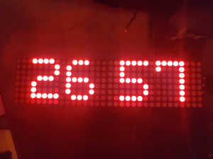
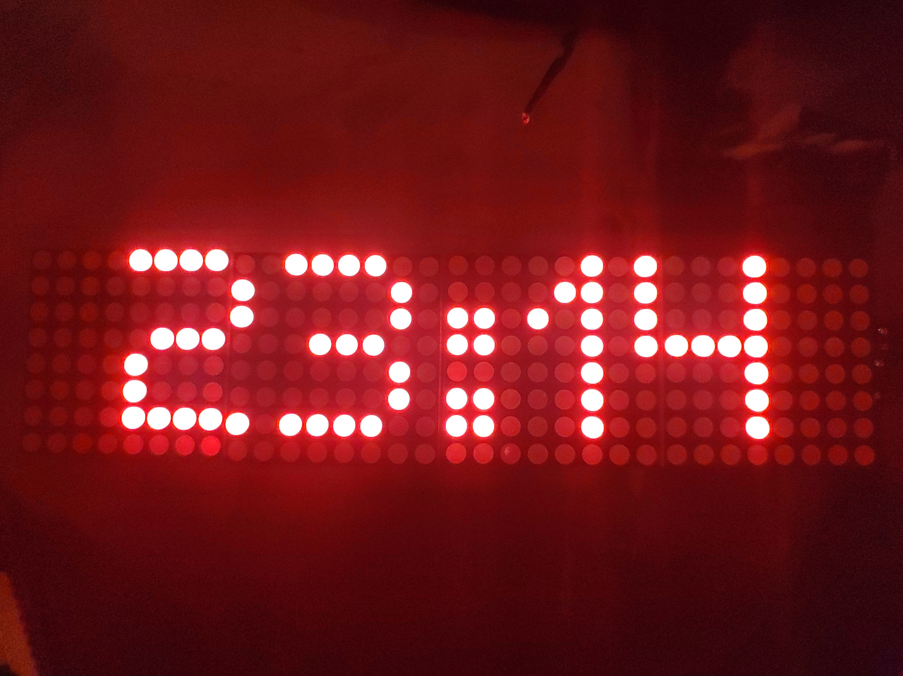

# ESP32 LED Matrix Clock & Weather Display

This project displays the current time, temperature, and humidity on a 4-module MAX7219 LED matrix, powered by an ESP32 and a DHT22 sensor.

## Features

- Real-time clock via NTP (with DST support for Europe)
- Temperature and Humidity reading via DHT22
- Alternating display between time and climate every few seconds
- Smooth scrolling text on MAX7219 32x8 LED matrix

## Hardware Used

- ESP32 (e.g. NodeMCU ESP32)
- 4× MAX7219 8×8 LED matrix modules (FC16-compatible)
- DHT22 temperature & humidity sensor (AM2302)
- 5V power supply (MAX7219 must be powered with 5V!)

## Wiring

| Component   | ESP32 Pin      |
|-------------|----------------|
| MAX7219 DIN | GPIO 23 (MOSI) |
| MAX7219 CLK | GPIO 18 (SCK)  |
| MAX7219 CS  | GPIO 5         |
| MAX7219 VCC | 5V (Vin)       |
| MAX7219 GND | GND            |
| DHT22 Data  | GPIO 4         |
| DHT22 VCC   | 3.3V or 5V     |
| DHT22 GND   | GND            |

*Note: Add a 10k pull-up resistor on the DHT22 data line if needed.*

## Libraries

Install the following PlatformIO libraries:

- [`DHT sensor library`](https://registry.platformio.org/libraries/adafruit/DHT%20sensor%20library)
- [`MD_Parola`](https://registry.platformio.org/libraries/MajicDesigns/MD_Parola)
- [`MD_MAX72XX`](https://registry.platformio.org/libraries/MajicDesigns/MD_MAX72XX)

